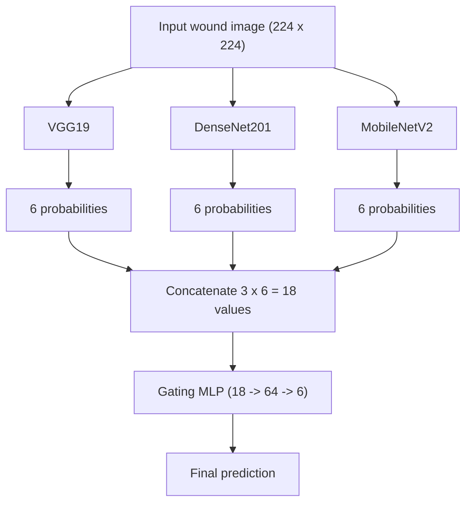
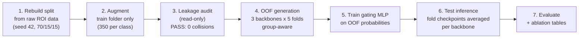

<div align="center">


# Chronic Wound Classification: Gated Multi-Model Fusion

**A leakage-free deep learning pipeline that classifies wound photographs into six categories, using three CNN backbones combined by a learned gating network.**

> **Research extension of** _"A Decision-Level Fusion Framework for Enhanced Multi-Class Chronic Wound Detection"_ by Shamoon, Mustafa, Urooj & Mushtaq (FAST NUCES). This project replaces that study's decision-fusion stage with a learned gating network trained on out-of-fold predictions, and re-runs the entire evaluation under an audited, leakage-safe protocol.


_Three clean evaluation iterations, all reported honestly:_
**Baseline 73.87% accuracy** → **Improvement Round 79.28% accuracy** → **Merged Data Round 79.28% accuracy with 79.80% macro F1**, on the same untouched test set.

</div>

---

## Table of Contents

- [Chronic Wound Classification: Gated Multi-Model Fusion](#chronic-wound-classification-gated-multi-model-fusion)
  - [Table of Contents](#table-of-contents)
  - [1. What this project does](#1-what-this-project-does)
  - [2. How the system works](#2-how-the-system-works)
  - [3. Processing pipeline](#3-processing-pipeline)
  - [4. What went wrong and how it was fixed](#4-what-went-wrong-and-how-it-was-fixed)
  - [5. Results](#5-results)
    - [5.1 Headline results: all three iterations](#51-headline-results-all-three-iterations)
    - [5.2 Per-class results and confusion matrices](#52-per-class-results-and-confusion-matrices)
    - [5.3 Ablation: the gate wins every comparison](#53-ablation-the-gate-wins-every-comparison)
  - [6. The Improvement Round](#6-the-improvement-round)
  - [7. The Merged Data Round (final)](#7-the-merged-data-round-final)
  - [8. Getting started](#8-getting-started)
  - [9. Repository structure](#9-repository structure)
  - [10. Reproducibility](#10-reproducibility)
  - [11. Limitations and roadmap](#11-limitations-and-roadmap)
    - [💡 The story in one line](#-the-story-in-one-line)
  - [Acknowledgments](#acknowledgments)

---

## 1. What this project does

Given one photograph, the system selects one of six labels:

| Class         | Meaning                                            |
| ------------- | -------------------------------------------------- |
| `background`  | No wound visible (surface, cloth, background skin) |
| `normal-skin` | Healthy intact skin                                |
| `diabetic`    | Diabetic foot ulcer                                |
| `venous`      | Venous leg ulcer                                   |
| `pressure`    | Pressure ulcer (bed sore)                          |
| `surgical`    | Surgical wound                                     |

**In plain language:** three experienced "specialist" models each look at the photo and give an opinion (six probabilities each). A small fourth network, the **gating network**, acts as a coordinator: it reads all three opinions and learns which specialist to trust more for _this particular image_. The coordinator's answer becomes the final classification.

Why an ensemble? Different architectures make different mistakes. A coordinator that weighs them per image can outperform any fixed combination, and this repository contains the experimental proof (Section 5.3): on the harder merged training data of the final round, every fixed combination lost accuracy while the learned gate held its ground.

## 2. How the system works



| Component                    | Where                                | What it does                                                                                          |
| ---------------------------- | ------------------------------------ | ----------------------------------------------------------------------------------------------------- |
| Backbones                    | `scripts/gen_oof_preds.py`           | Pretrained on ImageNet, six-class head added                                                          |
| Group-aware cross-validation | `scripts/gen_oof_preds.py`           | `StratifiedGroupKFold` (5 folds) keeps an original image and all its augmented copies inside one fold |
| Gating network               | `scripts/fusion/train_gating_mlp.py` | Small MLP trained on OOF probabilities only; validated on an OOF split, never on the test set         |
| Evaluation                   | `scripts/evaluate_gated_fusion.py`   | Computes metrics on the untouched test set                                                            |
| Ablation                     | `scripts/make_ablation_table.py`     | Compares singles, averaging, majority vote and gating from saved artifacts (no retraining)            |

**Training stages per backbone (per fold):** _Phase 1_ trains only the classification head while the pretrained feature extractor is frozen. _Phase 2_ unfreezes the last feature block and fine-tunes it at lr/10. It was skipped in the baseline iteration (CPU budget) and executed in the Improvement and Merged Data rounds (Sections 6 and 7).

## 3. Processing pipeline



Each numbered stage is one script; the commands are in [Section 8](#8-getting-started). Stage 3 must pass before any training is allowed to produce reportable numbers. The Merged Data Round repeats stages 4 to 7 on an enlarged training pool (Section 7); stages 1 to 3 and the test set are never modified.

## 4. What went wrong and how it was fixed

An earlier version of this pipeline contained **data leakage**: evaluation data influenced training in an invalid way, so the earlier accuracy was inflated and could not be reported. In plain terms, the model was being asked questions it had already seen the answers to. Two code bugs and one methodological flaw were identified:

| #   | Problem               | Plain description                                                                                                                            | Fix                                                                                                  |
| --- | --------------------- | -------------------------------------------------------------------------------------------------------------------------------------------- | ---------------------------------------------------------------------------------------------------- |
| 1   | Fallback copy         | When an expected test file was missing, the script silently copied a training image into the test folder                                     | Removed; a missing file now raises an error                                                          |
| 2   | Fabricated test paths | The gating stage _constructed_ test paths by renaming train paths instead of reading the real test directory                                 | Gating script now scans `data/processed/test/` directly; paths are never derived from train metadata |
| 3   | Non-group-aware split | Augmented copies of one source image could land on both sides of a fold boundary (near-duplicate leakage that filename checks cannot detect) | `StratifiedGroupKFold` with group = original source stem                                             |

Remediation performed:

- Train/val/test partitions were rebuilt directly from the raw AZH ROI source (seed 42, 70/15/15); augmentation touches the training folder only.
- All artifacts from the leaked configuration were archived locally and excluded from reporting.
- Independent audits were run and captured; both passed:

```
Exact filename collisions (train vs val/test): 0
  of which BYTE-IDENTICAL (confirmed leak):     0
Group-id collisions (original/aug siblings):   0
>>> No leakage detected.
```

The captured audit outputs are committed at `outputs/leakage_audit_output.txt` and `outputs/check_clean_split_output.txt`.

> **Engineering principle adopted:** never fabricate data to satisfy a code path. A missing file is information that something upstream is broken; fail loudly instead of inventing the missing piece.

## 5. Results

All numbers come from evaluations on a clean, untouched test set of **111 images**. Three iterations are reported; each configuration was evaluated exactly once and never used for tuning.

### 5.1 Headline results: all three iterations

| Metric                   | Baseline (first clean iteration) | Improvement Round          | **Final (Merged Data Round)**    |
| ------------------------ | -------------------------------- | -------------------------- | -------------------------------- |
| **Overall accuracy**     | 73.87% (82 / 111)                | 79.28% (88 / 111)          | **79.28% (88 / 111)**            |
| **Macro F1**             | 74.49%                           | 79.43%                     | **79.80%**                       |
| **Weighted F1**          | 74.33%                           | 79.44%                     | **79.52%**                       |
| 95% Wilson CI (accuracy) | 65.0% to 81.1%                   | 70.8% to 85.8%             | 70.8% to 85.8%                   |
| Accuracy, wound images only | 66.67% (54 / 81)              | 71.60% (58 / 81)           | **75.31% (61 / 81)**             |

Rounds 2 and 3 land on the same accuracy count (88 of 111) with a different error distribution; at this test size they are statistically indistinguishable on accuracy. The verified gains of the final round are the designed ones: macro F1 reaches its highest value across all rounds, the weakest class improves materially (Section 5.2), and accuracy on true wound images, the more clinically meaningful view, rises from 66.67% to 75.31%. With 111 test images, differences smaller than ~5 accuracy points are within statistical noise; all results are stated with this uncertainty attached. The baseline is retained as documentation of the pipeline's first honest iteration: **no result in this repository has ever been tuned against the test set** (recipe and gate decisions were made on out-of-fold validation metrics only, see Sections 6 and 7).

### 5.2 Per-class results and confusion matrices

**Final model (Merged Data Round):**

| Class       | Precision | Recall | F1     | Test images |
| ----------- | --------- | ------ | ------ | ----------- |
| background  | 1.0000    | 0.8667 | 0.9286 | 15          |
| diabetic    | 0.7200    | 0.7826 | 0.7500 | 23          |
| normal-skin | 1.0000    | 0.9333 | 0.9655 | 15          |
| pressure    | 0.5333    | 0.5333 | 0.5333 | 15          |
| surgical    | 0.8333    | 0.7895 | 0.8108 | 19          |
| venous      | 0.7692    | 0.8333 | 0.8000 | 24          |

Rows = true class, columns = predicted class (order: background, diabetic, normal-skin, pressure, surgical, venous), across the three iterations:

```
Baseline:                          Improvement:                      Merged (final):
[[14  0  1  0  0  0]               [[15  0  0  0  0  0]              [[13  0  0  1  0  1]
 [ 0 16  0  3  0  4]                [ 0 19  0  1  0  3]               [ 0 18  0  2  0  3]
 [ 0  1 14  0  0  0]                [ 0  0 15  0  0  0]               [ 0  1 14  0  0  0]
 [ 0  2  0  7  4  2]                [ 0  2  0  7  4  2]               [ 0  3  0  8  3  1]
 [ 0  2  0  5 11  1]                [ 0  2  0  5 12  0]               [ 0  1  0  2 15  1]
 [ 0  0  0  4  0 20]]               [ 0  0  0  4  0 20]]              [ 0  2  0  2  0 20]]
```

**Honest reading:** the Merged Data Round was designed to fix the weakest classes, and it did. Pressure F1 rose from 0.4375 to **0.5333** (precision rose from 0.4118 to 0.5333, so a pressure call is now right more often than wrong, 8 of 15) and surgical F1 rose from 0.6857 to **0.8108**. The pressure and surgical exchange that dominated earlier rounds (9 of 29 errors) fell to 5 errors. The trade is stated openly: the two previously perfect non-wound classes conceded one real error each, venous slipped slightly (0.8163 to 0.8000), and diabetic became the main confusion sink (F1 0.8261 to 0.7500, precision 0.7200) as errors redistributed. **Pressure remains the weakest class and this is stated explicitly rather than hidden**; pressure predictions from the current system should not be acted on clinically, and it drives the roadmap (Section 11).

### 5.3 Ablation: the gate wins every comparison

All methods evaluated on the same clean test set from saved artifacts (no retraining). **Final configuration (Merged Data Round):**

| Method                              | Accuracy   | Macro F1  | Weighted F1 |
| ----------------------------------- | ---------- | --------- | ----------- |
| VGG19 (single)                      | 69.37%     | 69.78     | 69.13       |
| DenseNet201 (single)                | 73.87%     | 73.38     | 73.46       |
| MobileNetV2 (single)                | 70.27%     | 70.96     | 70.59       |
| Simple average fusion               | 77.48%     | 77.94     | 77.73       |
| Majority vote (ties by summed probability) | 75.68% | 76.46   | 76.04       |
| **Gated MLP fusion (final method)** | **79.28%** | **79.80** | **79.52**   |

The Merged Data Round is the strongest evidence yet for the central claim. Under the harder merged training distribution, every single backbone and every fixed fusion rule **lost** accuracy relative to round 2 (best single 76.58% to 73.87%, simple average 78.38% to 77.48%, majority vote 78.38% to 75.68%); the learned gate alone held its top line. Its final margins are **+6.43 macro F1 over the best single backbone**, **+1.87 over simple averaging** and **+3.35 over majority voting** (round 2 margins: +2.98, +1.72, +1.76). The value of learned per-image weighting _grows_ exactly when the problem gets harder. This is the central experimental finding of the project.

## 6. The Improvement Round

After the baseline was frozen, a single controlled improvement round was executed on a free cloud GPU (Colab T4, ~5 h total vs ~30 h CPU for the baseline). The data pipeline was untouched; only the training recipe changed:

| Element             | Baseline     | Improvement Round                    | Why                                                           |
| ------------------- | ------------ | ------------------------------------ | ------------------------------------------------------------- |
| Phase 1 epochs      | up to 8      | up to 20 (early stopping patience 5) | Baseline logs showed validation loss still falling at epoch 8 |
| Phase 2 fine-tuning | not executed | executed (last block, lr/10)         | The lever CPU constraints had prevented                       |
| Label smoothing     | 0.0          | 0.1                                  | Reduces overconfidence on visually overlapping classes        |

**Evaluation discipline:** out-of-fold gains were confirmed first (VGG +0.01, DenseNet +2.81, MobileNet +5.03 macro F1) and only then was the final test evaluation run, once. An identical re-run after a session failure reproduced identical loss values, confirming deterministic seeding.

## 7. The Merged Data Round (final)

After the Improvement Round the remaining weakness was class level rather than headline level: pressure stood at F1 0.4375 and most residual errors were wound-to-wound. The direction, adding real images from the freely shared **Medetec wound image database** to the classes that need them (diabetic, pressure, venous), follows the documented data strategy of the underlying AZHMT study; no other sources were pursued and the validation and test sets were not touched.

**Training pool rebuilt from scratch (audited actuals):**

| Source | Diabetic | Pressure | Venous | Total |
| ------ | -------- | -------- | ------ | ----- |
| AZH originals (all classes) | 108 | 70 | 109 | 517 |
| Medetec added               | 48  | 175 | 72  | 295 |
| **Total real**              | 156 | 245 | 181 | **812** |

Augmentation was regenerated from real images only, to the same balanced 350 per class target (2,100 training images). Pressure's real share rose from 20% (70 of 350) to **70%** (245 of 350): the model now trains mostly on real pressure wounds instead of synthetic copies. The merge audit recorded 0 Medetec images in validation or test.

**Execution:** all three backbones were retrained from scratch (5 fold group-aware CV per backbone; Phase 1 up to 40 epochs with patience 5, Phase 2 up to 12, Colab T4), then the identical gate. One operational incident is recorded for transparency: an initial gate run resolved model artifacts through a legacy naming fallback and began training on the previous round's out-of-fold probabilities; it crashed before any test evaluation, those artifacts were discarded, model paths were pinned explicitly to the merged outputs, and only the corrected run is reported. Results are in Sections 5.1 to 5.3.

**Gate robustness sweep (out of fold only, test never consulted):** 24 gate configurations (2 feature variants x 3 hidden widths x 4 seeds) were compared on the merged OOF probabilities; the leading configurations and the shipped configuration were revalidated across 5 additional validation splits, plus a 5 seed ensemble. All landed within 0.0005 macro F1 of each other (shipped config 0.8462 ± 0.0061); the shipped configuration was kept and no second test pass was run. Conclusion: the gains of this round come from the **data**, not from tuning the combiner.

Full methodology, per-class tables and the three round comparison: `docs/REPORT.md`, Section 17.

## 8. Getting started

Prerequisites: Python 3.11+, Git. A CUDA GPU is _not_ required for the baseline recipe (it was designed for, and completed on, CPU only). The Improvement and Merged Data rounds were executed on a free Colab T4.

```powershell
git clone https://github.com/AbdurRehmanKhan-ARK/chronic-wound-fusion.git
cd chronic-wound-fusion

python -m venv .venv
.\.venv\Scripts\activate
pip install -r requirements.txt
```

Core dependencies: `torch`, `torchvision`, `scikit-learn>=1.1` (for `StratifiedGroupKFold`), `numpy`, `pandas`, `Pillow`, `matplotlib`.

Full pipeline, in execution order (repo root, venv active):

```powershell
# 1. Rebuild clean train/val/test from the raw AZH ROI data (seed 42, 70/15/15)
python scripts\rebuild_clean_split.py

# 2. Augment the training folder ONLY (balanced 350 per class, seed 42)
python scripts\augment_train_only.py

# 3. Audit split integrity (read-only; must PASS before training)
python leakage_audit.py
python scripts\check_clean_split.py

# 4a. Baseline recipe: Phase 1 only, 8 epochs
python scripts\gen_oof_preds.py --model vgg19        --folds 5 --phase1-epochs 8 --batch-size 16 --lr 1e-4 --weight-decay 1e-4 --output outputs\01_oof\vgg19_clean
python scripts\gen_oof_preds.py --model densenet201  --folds 5 --phase1-epochs 8 --batch-size 16 --lr 1e-4 --weight-decay 1e-4 --output outputs\01_oof\densenet201_clean
python scripts\gen_oof_preds.py --model mobilenet_v2 --folds 5 --phase1-epochs 8 --batch-size 16 --lr 1e-4 --weight-decay 1e-4 --output outputs\01_oof\mobilenetv2_clean

# 4b. Improvement Round recipe -  add Phase 2, longer training, label smoothing
python scripts\gen_oof_preds.py --model vgg19 --folds 5 --phase1-epochs 20 --phase2 --label-smoothing 0.1 --batch-size 16 --lr 1e-4 --weight-decay 1e-4 --output outputs\01_oof\vgg19_improved
python scripts\gen_oof_preds.py --model densenet201 --folds 5 --phase1-epochs 20 --phase2 --label-smoothing 0.1 --batch-size 16 --lr 1e-4 --weight-decay 1e-4 --output outputs\01_oof\densenet201_improved
python scripts\gen_oof_preds.py --model mobilenet_v2 --folds 5 --phase1-epochs 20 --phase2 --label-smoothing 0.1 --batch-size 16 --lr 1e-4 --weight-decay 1e-4 --output outputs\01_oof\mobilenet_v2_improved

# 5. Train the gating MLP on OOF probabilities + clean test evaluation
python scripts\fusion\train_gating_mlp.py --models vgg19,densenet201,mobilenet_v2 --oof-dir outputs\01_oof --output outputs\02_gating

# 6. Final metrics report and confusion matrix
python scripts\evaluate_gated_fusion.py --preds-csv outputs\02_gating\gating_test_preds_v1.csv --output outputs\03_figures

# 7. Ablation / fusion comparison table (no retraining, no GPU needed)
python scripts\make_ablation_table.py --probs outputs\02_gating\gating_test_probs_v1.npy --preds outputs\02_gating\gating_test_preds_v1.csv
```

**Merged Data Round (final reported configuration):** the merged training pool is built first as documented in `docs/REPORT.md`, Section 17.2 (staging and merge audit). The training, gating and evaluation steps are then identical to steps 4b to 7 with `--phase1-epochs 40`, the merged data root, and the output folders `outputs\01_oof\*_merged`, `outputs\02_gating_merged` and `outputs\03_figures_merged`.

Each OOF run saves `{model}_oof_probs.npy`, `{model}_oof_meta.csv`, and `checkpoints/{model}_fold{k}_best.pt`. The gating run saves `gating_mlp_model_v1.pt`, `gating_test_probs_v1.npy` (111 x 18) and `gating_test_preds_v1.csv`.

## 9. Repository structure

Scripts marked **[pipeline]** are the canonical pipeline used for the reported results. Scripts marked **[legacy]** are earlier prototypes kept for reference and are not part of the reported pipeline.

```
chronic-wound-fusion/
├── README.md                          # Main project guide: setup, pipeline, results, and usage
├── leakage_audit.py                   # [pipeline] read-only split-integrity audit for file collisions and group leakage
├── requirements.txt                   # Python dependencies for training, evaluation, and preprocessing
├── configs/
│   └── default.yaml                   # [legacy] prototype config; not the source of truth for the reported runs
├── docs/
│   ├── REPORT.md                      # Full verified project report: debugging story, all three rounds, and evidence
│   ├── assets/
│   │   └── banner.png                 # Repository banner image used in documentation
│   ├── project-plan.docx              # Original project plan and early research design
│   ├── Final-Report.pdf               # Final report PDF used for submission/reference
│   ├── FYPReport_ChronicWounds5.docx # Word report draft used during project documentation
│   ├── IEEE_Conference_ chronic wound_ (1).pdf # Conference-style source/reference document
│   └── chronic_fusion_extracted.txt   # Extracted text from earlier written report drafts
├── notebooks/
│   └── 01_setup_check.ipynb           # Environment sanity check and package validation notebook
├── outputs/
│   ├── leakage_audit_output.txt       # Audit result: 0 exact collisions + 0 group collisions; PASS
│   ├── check_clean_split_output.txt   # Clean-split validation output: 0 duplicates across train/val/test; PASS
│   ├── split_counts.txt               # Verified per-class split counts: train/val/test totals
│   ├── 01_oof/                        # Per-backbone OOF probability arrays and metadata (local, reproducible)
│   │   └── ...                        # *_clean and *_improved folders; round 3 adds *_merged variants
│   ├── 02_gating/                     # Trained gating model, fused probabilities, saved test predictions
│   │   └── ...                        # Gating MLP weights and clean-test fusion outputs
│   ├── 02_gating_merged/              # Round 3 (final): gate model, merged test probabilities and predictions
│   ├── 03_figures/                    # Baseline iteration evaluation figures and reports
│   ├── 03_figures_improved/           # Improvement Round results (79.28% accuracy, 79.43% macro F1)
│   └── 03_figures_merged/             # Round 3 final results: evaluation report, confusion matrix, ablation table
├── scripts/
│   ├── rebuild_clean_split.py         # [pipeline] rebuilds raw ROI data into clean train/val/test split (seed 42, 70/15/15)
│   ├── augment_train_only.py          # [pipeline] offline train-only augmentation with class balancing
│   ├── check_clean_split.py           # [pipeline] verifies no overlap across train/val/test partitions
│   ├── gen_oof_preds.py               # [pipeline] group-aware 5-fold OOF prediction generation for each backbone
│   ├── fusion/
│   │   └── train_gating_mlp.py        # [pipeline] canonical gating trainer + clean test evaluation logic
│   ├── evaluate_gated_fusion.py       # [pipeline] computes final metrics from fused gating predictions
│   ├── make_ablation_table.py         # [pipeline] builds the ablation/fusion comparison table from saved artifacts
│   ├── dataset_stats.py               # [utility] per-split, per-class image counts and summary stats
│   ├── verify_data.py                 # [utility] checks raw ROI dataset counts and integrity
│   ├── augment_and_save.py            # [legacy] older augmentation variant retained for comparison only
│   ├── train_base.py                  # [legacy] single-model baseline prototype
│   ├── train_backbone_small.py        # [legacy] small-subset backbone experiments
│   ├── train_vgg_small.py             # [legacy] VGG small-subset exploratory training
│   ├── evaluate_vgg.py                # [legacy] older VGG evaluation helper
│   ├── evaluate_checkpoint.py         # [legacy] older checkpoint evaluation utility
│   ├── train_gating.py                # [legacy] lighter OOF-only gate trainer without final clean-test evaluation
│   └── parse_docx.py                  # [utility] docx extraction helper used for report drafting
├── src/
│   ├── data/
│   │   ├── dataset.py                 # Dataset loader and sample handling for train/val/test splits
│   │   └── preprocess.py              # Image normalization and preprocessing helpers
│   └── models/
│       ├── backbones.py               # VGG19 / DenseNet201 / MobileNetV2 architecture loaders
│       └── gating.py                  # Older feature-based gate variant; canonical gate is in scripts/fusion/train_gating_mlp.py
├── archive/                           # Archived legacy or leakage-era experiments kept for audit/reference
│   └── ...                            # Old outputs and cleanup-era artifacts retained outside the canonical pipeline
├── data/
│   └── raw/                           # Local raw source dataset; not version-controlled in the main repo
│       └── azh/
│           └── wound_classification-main/
│               └── ...                # Original AZH ROI dataset and metadata copied from the upstream source
└── .gitignore                         # Excludes generated data, checkpoints, and local artifacts from Git
```

`data/` (raw and processed) and the large intermediate outputs (`outputs/01_oof/`, `outputs/02_gating*/`, checkpoint files, and `.npy` arrays) are generated locally and excluded from version control via `.gitignore`; they are reproducible with the Section 8 commands. The committed text files under `outputs/` are the captured verification evidence.

## 10. Reproducibility

| Item               | Value                                                                                                                      |
| ------------------ | -------------------------------------------------------------------------------------------------------------------------- |
| Random seed        | 42 (fixed across Python, NumPy, PyTorch; folds and the gate's validation split included)                                   |
| Split              | 70/15/15 per class from raw ROI data; test = 111 images (15/23/15/15/19/24)                                                |
| Training data      | 2,100 images (balanced 350 per class after augmentation); val = 110 originals; no augmented or Medetec file in val or test (audited) |
| Input              | 224 x 224, ImageNet normalization (mean 0.485/0.456/0.406, std 0.229/0.224/0.225)                                          |
| Baseline training  | Phase 1 only: up to 8 epochs/fold, patience 5, Adam lr 1e-4, wd 1e-4, batch 16; CPU only (~30 h total)                     |
| Improvement Round  | Phase 1 (up to 20 epochs) + Phase 2 (last block, lr/10), label smoothing 0.1; Colab T4 GPU (~5 h)                          |
| Merged Data Round  | Pool from 812 real images (517 AZH + 295 Medetec), augmentation regenerated, 350 per class; Phase 1 up to 40 epochs (patience 5) + Phase 2 up to 12; Colab T4 |
| Gating             | MLP 18-64-6, Dropout 0.2, up to 50 epochs, patience 5, batch 64, lr 1e-3, wd 1e-4; validated on a 20% stratified OOF split |
| Gate robustness    | 24 configurations compared on OOF only, revalidated over 5 splits; spread 0.0005 macro F1; shipped config kept; test not consulted |
| Pretrained weights | torchvision `IMAGENET1K_V1` for all three backbones                                                                        |
| Test inference     | Per backbone: softmax averaged over the 5 fold checkpoints; concatenated 18-value vector fed to the gate                   |
| Determinism        | An identical re-run of the final recipe reproduced identical loss values (seed verification)                               |

Notes: per-fold epoch counts and the gate's exact stopping epoch were printed to console only and are documented as "up to N with early stopping" (the round 3 gate early stopped at epoch 33). The class in `src/models/gating.py` is an older feature-based variant; the canonical gate used by the pipeline is `GatingMLP` in `scripts/fusion/train_gating_mlp.py`.

## 11. Limitations and roadmap

**Known limitations, stated openly:**

1. Small test set (111 images, 15 to 24 per class) gives wide confidence intervals (Section 5.1).
2. Single dataset (AZH) at evaluation time; other cameras, centres and populations are untested.
3. Grouping is by source image stem; the AZH ROI release has no patient IDs, so patient-level independence is not guaranteed.
4. **Pressure remains the weakest class** (F1 0.5333 even in the final model, wide interval) and diabetic became the largest error sink after the merged round. This system is a research prototype, not a clinical tool.

**Roadmap:**

1. ✅ ~~More pressure-class data, the most direct remedy for the weakest class~~ executed: the Merged Data Round added 295 real Medetec images (175 pressure) and pressure F1 rose 0.4375 to 0.5333.
2. Class-weighted or focal loss experiments for the residual wound-to-wound boundaries, now centred on the diabetic sink (selected on OOF/validation only).
3. Gate calibration (temperature scaling, selected on validation only).
4. External-dataset validation before any clinical claim.
5. Patient-level grouping if identifiers ever become available.

---

<div align="center">

### 💡 The story in one line

> **We audited our own pipeline, caught the leakage that made our first numbers lie,
> rebuilt everything honestly, and then improved the honest number twice.**

**73.87%** _was not a failure. It was the first number we could trust._
**79.28%** _is what disciplined, leakage-free iteration looks like, and the second time around_
**the same 79.28% came with a fairer error distribution: macro F1 79.80% and our weakest classes finally moving.** 🎯

Built with ☕, 🧠 and a lot of 🔍 by **Abdur Rehman Khan (24K-0767, BCS-G)**
Research Extension · FAST NUCES · Supervised by **Ms. Sania Urooj**

⭐ _If this repository helped you understand leakage-free ML evaluation, consider starring it._

</div>

## Acknowledgments

- 📄 **Prior work**: _A Decision-Level Fusion Framework for Enhanced Multi-Class Chronic Wound Detection_, S. Shamoon, A. Mustafa, S. Urooj, M. Mushtaq (FAST NUCES). This repository is a leakage-safe extension of that study.
- 👩‍🏫 **Ms. Sania Urooj**: supervisor of this extension and co-author of the original study.
- 🩹 **AZH wound dataset**: Advancing the Zenith in Healthcare chronic wound dataset.
- 🖼️ **Medetec wound image database** (medetec.co.uk): publicly shared clinical wound galleries; the additional real training images for the diabetic, pressure and venous classes follow the documented Medetec subset approach of the AZHMT study.
- 🤖 Pretrained architectures via **torchvision** (VGG19, DenseNet201, MobileNetV2, ImageNet weights).
- ☁️ Improvement and Merged Data round compute via **Google Colab** (free T4 GPU).
U).
