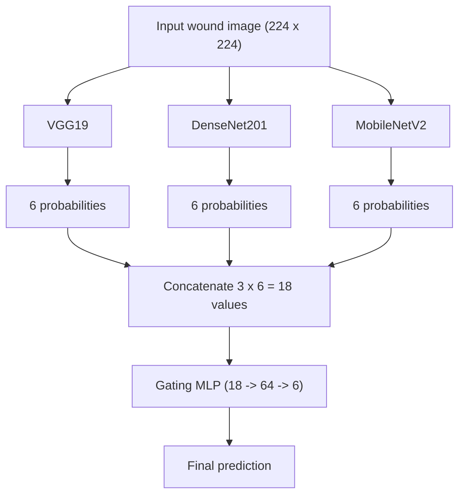
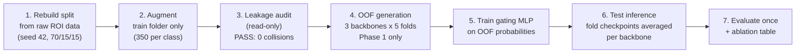

# Chronic Wound Classification -  Gated Multi-Model Fusion

A leakage-free deep learning pipeline that classifies wound photographs into six categories using three CNN backbones (VGG19, DenseNet201, MobileNetV2) combined by a learned gating network trained on out-of-fold (OOF) predictions.

---

## Table of Contents

- [Chronic Wound Classification -  Gated Multi-Model Fusion](#chronic-wound-classification----gated-multi-model-fusion)
  - [Table of Contents](#table-of-contents)
  - [1. What this project does](#1-what-this-project-does)
  - [2. How the system works](#2-how-the-system-works)
  - [3. Processing pipeline](#3-processing-pipeline)
  - [4. What went wrong and how it was fixed](#4-what-went-wrong-and-how-it-was-fixed)
  - [5. Results](#5-results)
    - [5.1 Overall metrics](#51-overall-metrics)
    - [5.2 Per-class results and confusion matrix](#52-per-class-results-and-confusion-matrix)
    - [5.3 Ablation and fusion comparison](#53-ablation-and-fusion-comparison)
  - [6. Getting started](#6-getting-started)
  - [7. Repository structure](#7-repository-structure)
  - [8. Reproducibility](#8-reproducibility)
  - [9. Limitations and roadmap](#9-limitations-and-roadmap)
  - [Acknowledgments](#acknowledgments)

---

## 1. What this project does

Given one photograph, the system selects one of six labels:

| Class | Meaning |
|---|---|
| `background` | No wound visible (surface, cloth, background skin) |
| `normal-skin` | Healthy intact skin |
| `diabetic` | Diabetic foot ulcer |
| `venous` | Venous leg ulcer |
| `pressure` | Pressure ulcer (bed sore) |
| `surgical` | Surgical wound |

**In plain language:** three experienced "specialist" models each look at the photo and give an opinion (six probabilities each). A small fourth network -  the **gating network** -  acts as a coordinator: it reads all three opinions and learns which specialist to trust more for *this particular image*. The coordinator's answer becomes the final classification.

Why an ensemble? Different architectures make different mistakes. A coordinator that weighs them per image can outperform any fixed combination -  and this is verified experimentally in this project (Section 5.3).

## 2. How the system works



Key components:

| Component | Where | What it does |
|---|---|---|
| Backbones | `scripts/gen_oof_preds.py` | Pretrained on ImageNet, six-class head added; trained with backbone frozen (Phase 1) |
| Group-aware cross-validation | `scripts/gen_oof_preds.py` | `StratifiedGroupKFold` (5 folds) keeps an original image and all its augmented copies inside one fold |
| Gating network | `scripts/fusion/train_gating_mlp.py` | Small MLP trained on OOF probabilities only; validated on an OOF split, never on the test set |
| Evaluation | `scripts/evaluate_gated_fusion.py` | Computes metrics exactly once on the untouched test set |
| Ablation | `scripts/make_ablation_table.py` | Compares singles, averaging, majority vote and gating from saved artifacts (no retraining) |

**Training stages per backbone (per fold):** *Phase 1* trains only the classification head while the pretrained feature extractor is frozen (up to 8 epochs, early stopping patience 5, Adam, lr 1e-4). *Phase 2* (optional, off by default) would unfreeze the last feature block and fine-tune it at lr/10 -  it was **not** executed for the reported results.

## 3. Processing pipeline



Each numbered stage is one script; the commands are in [Section 6](#6-getting-started). Stage 3 must pass before any training is allowed to produce reportable numbers.

## 4. What went wrong and how it was fixed

An earlier version of this pipeline contained **data leakage**: evaluation data influenced training in an invalid way, so the earlier accuracy was inflated and could not be reported. In plain terms, the model was being asked questions it had already seen the answers to. Two code bugs and one methodological flaw were identified:

| # | Problem | Plain description | Fix |
|---|---|---|---|
| 1 | Fallback copy | When an expected test file was missing, the script silently copied a training image into the test folder | Removed; a missing file now raises an error |
| 2 | Fabricated test paths | The gating stage *constructed* test paths by renaming train paths instead of reading the real test directory | Gating script now scans `data/processed/test/` directly; paths are never derived from train metadata |
| 3 | Non-group-aware split | Augmented copies of one source image could land on both sides of a fold boundary (near-duplicate leakage that filename checks cannot detect) | `StratifiedGroupKFold` with group = original source stem |

Remediation performed:

- Train/val/test partitions were rebuilt directly from the raw AZH ROI source (seed 42, 70/15/15); augmentation touches the training folder only.
- All artifacts from the leaked configuration were archived locally (`archive/cleanup_2026_09_12/`) and excluded from reporting.
- Independent audits were run and captured; both passed:

```
Exact filename collisions (train vs val/test): 0
  of which BYTE-IDENTICAL (confirmed leak):     0
Group-id collisions (original/aug siblings):   0
>>> No leakage detected.
```

**Engineering principle adopted:** never fabricate data to satisfy a code path. A missing file is information that something upstream is broken -  fail loudly instead of inventing the missing piece.

## 5. Results

All numbers below come from a single evaluation on a clean, untouched test set of **111 images**, produced by the corrected pipeline (results file: `outputs/03_figures/gated_fusion_evaluation_report.txt`).

### 5.1 Overall metrics

| Metric | Value |
|---|---|
| **Overall accuracy** | **73.87%** (82 / 111) |
| **Macro F1** | **74.49%** |
| **Weighted F1** | **74.33%** |

With only 111 test images, the 95% Wilson confidence interval for accuracy is approximately **65.0% – 81.1%**; differences smaller than ~5 accuracy points between model variants should not be treated as meaningful.

### 5.2 Per-class results and confusion matrix

| Class | Precision | Recall | F1 | Test images |
|---|---|---|---|---|
| background | 1.0000 | 0.9333 | 0.9655 | 15 |
| diabetic | 0.7619 | 0.6957 | 0.7273 | 23 |
| normal-skin | 0.9333 | 0.9333 | 0.9333 | 15 |
| pressure | 0.3684 | 0.4667 | 0.4118 | 15 |
| surgical | 0.7333 | 0.5789 | 0.6471 | 19 |
| venous | 0.7407 | 0.8333 | 0.7843 | 24 |

Rows = true class, columns = predicted class (order: background, diabetic, normal-skin, pressure, surgical, venous):

```
[[14  0  1  0  0  0]
 [ 0 16  0  3  0  4]
 [ 0  1 14  0  0  0]
 [ 0  2  0  7  4  2]
 [ 0  2  0  5 11  1]
 [ 0  0  0  4  0 20]]
```

**Honest reading:** background, normal-skin and venous perform reliably. **Pressure is the weakest class and behaves as a confusion sink**: the model predicted "pressure" 19 times but only 7 were correct (the rest came from surgical 5, venous 4, diabetic 3), and 8 of the 15 true pressure images escaped to other classes. Pressure–surgical confusion alone accounts for 9 of 29 total errors (~31%). Pressure predictions from the current system should not be acted on; this is stated explicitly rather than hidden, and drives the roadmap in Section 9.

### 5.3 Ablation and fusion comparison

All methods evaluated on the same clean test set from saved artifacts (`scripts/make_ablation_table.py`, no retraining):

| Method | Accuracy | Macro F1 | Weighted F1 |
|---|---|---|---|
| VGG19 (single) | 71.17% | 71.09 | 70.67 |
| DenseNet201 (single) | 72.07% | 72.80 | 72.32 |
| MobileNetV2 (single) | 74.77% | 74.40 | 74.49 |
| Simple average fusion | 72.97% | 72.70 | 72.34 |
| Majority vote | 75.68% | 75.77 | 75.44 |
| **Gated MLP fusion (final method)** | **73.87%** | **74.49** | **74.33** |

*Interpretation:* the learned gate **clearly outperforms simple averaging** (+1.79 macro F1, +0.90 accuracy -  the value proposition of per-image weighting) and is **statistically tied with the strongest single backbone**. Majority voting's nominal lead (+1.28 macro F1) lies within the noise band of this test size. Gating is retained for its consistent advantage over fixed-weight fusion and its per-sample interpretability.

## 6. Getting started

Prerequisites: Python 3.11+, Git. A CUDA GPU is *not* required (the reported run was trained on CPU only, Section 8).

```powershell
git clone https://github.com/AbdurRehmanKhan-ARK/chronic-wound-fusion.git
cd chronic-wound-fusion

python -m venv .venv
.\.venv\Scripts\activate
pip install -r requirements.txt
```

Core dependencies: `torch`, `torchvision`, `scikit-learn>=1.1` (required for `StratifiedGroupKFold`), `numpy`, `pandas`, `Pillow`, `matplotlib`.

Full pipeline, in execution order (run from the repo root with the venv active):

```powershell
# 1. Rebuild clean train/val/test from the raw AZH ROI data (seed 42, 70/15/15)
python scripts\rebuild_clean_split.py

# 2. Augment the training folder ONLY (balanced 350 per class, seed 42)
python scripts\augment_train_only.py

# 3. Audit split integrity (read-only; must PASS before training)
python leakage_audit.py
python scripts\check_clean_split.py

# 4. Generate OOF predictions per backbone (Phase 1 only; add --phase2 to enable fine-tuning)
python scripts\gen_oof_preds.py --model vgg19        --folds 5 --phase1-epochs 8 --batch-size 16 --lr 1e-4 --weight-decay 1e-4 --output outputs\01_oof\vgg19_clean
python scripts\gen_oof_preds.py --model densenet201  --folds 5 --phase1-epochs 8 --batch-size 16 --lr 1e-4 --weight-decay 1e-4 --output outputs\01_oof\densenet201_clean
python scripts\gen_oof_preds.py --model mobilenet_v2 --folds 5 --phase1-epochs 8 --batch-size 16 --lr 1e-4 --weight-decay 1e-4 --output outputs\01_oof\mobilenetv2_clean

# 5. Train the gating MLP on OOF probabilities + clean test evaluation
python scripts\fusion\train_gating_mlp.py --models vgg19,densenet201,mobilenet_v2 --oof-dir outputs\01_oof --output outputs\02_gating

# 6. Final metrics report and confusion matrix
python scripts\evaluate_gated_fusion.py --preds-csv outputs\02_gating\gating_test_preds_v1.csv --output outputs\03_figures

# 7. Ablation / fusion comparison table (no retraining, no GPU needed)
python scripts\make_ablation_table.py
```

Each OOF run saves `{model}_oof_probs.npy`, `{model}_oof_meta.csv`, and `checkpoints/{model}_fold{k}_best.pt`. The gating run saves `gating_mlp_model_v1.pt`, `gating_test_probs_v1.npy` (111 x 18) and `gating_test_preds_v1.csv`.

## 7. Repository structure

```
chronic-wound-fusion/
├── README.md
├── leakage_audit.py                  # Standalone split-integrity audit (read-only)
├── requirements.txt
├── configs/default.yaml              # Legacy prototype config (does not describe the reported run)
├── docs/
│   ├── REPORT.md                     # Full verified project report
│   └── verification_checklist.md     # How the verification artifacts were produced
├── scripts/
│   ├── rebuild_clean_split.py        # Raw ROI -> clean train/val/test (seed 42)
│   ├── augment_train_only.py         # Balanced offline augmentation, train only
│   ├── check_clean_split.py          # Partition overlap check
│   ├── gen_oof_preds.py              # Group-aware 5-fold OOF training per backbone
│   ├── make_ablation_table.py        # Singles vs averaging vs voting vs gate
│   ├── dataset_stats.py              # Per-split, per-class image counts
│   ├── evaluate_gated_fusion.py      # Final metrics from gate predictions
│   └── fusion/train_gating_mlp.py    # Canonical gating trainer + clean test evaluation
├── src/
│   ├── data/dataset.py, preprocess.py
│   └── models/backbones.py, gating.py
└── outputs/03_figures/               # Final evaluation report + confusion matrix figure
```

`data/` (raw and processed) and intermediate outputs (`outputs/01_oof/`, `outputs/02_gating/`, checkpoints) are generated locally and excluded from version control via `.gitignore`.

## 8. Reproducibility

| Item | Value |
|---|---|
| Random seed | 42 (fixed across Python, NumPy, PyTorch; `StratifiedGroupKFold` and the gate's validation split included) |
| Split | 70/15/15 per class from raw ROI data; test = 111 images (15/23/15/15/19/24) |
| Training data | 2,100 images (balanced 350 per class after augmentation); val = 110 originals; no augmented file in val or test (audited) |
| Input | 224 x 224, ImageNet normalization (mean 0.485/0.456/0.406, std 0.229/0.224/0.225) |
| Backbone training | Phase 1 only: up to 8 epochs per fold, early stopping patience 5, Adam, lr 1e-4, weight decay 1e-4, batch 16, CrossEntropyLoss; pretrained torchvision `IMAGENET1K_V1` weights |
| Gating | MLP 18-64-6, Dropout 0.2, up to 50 epochs, patience 5, batch 64, lr 1e-3, weight decay 1e-4; validated on a 20% stratified OOF split |
| Hardware | **CPU only** (no CUDA device on the training machine) |
| Approx. runtime | VGG19 ≈ 24 h (5 folds); DenseNet201 and MobileNetV2 ≈ 3–4 h each; gate < 5 min |
| Test inference | Per backbone: softmax averaged over the 5 fold checkpoints; concatenated 18-value vector fed to the gate |

Notes: per-fold epoch counts and the gate's exact stopping epoch were printed to console only and are documented as "up to N with early stopping". The class in `src/models/gating.py` is an older feature-based variant; the canonical gate used by the pipeline is `GatingMLP` in `scripts/fusion/train_gating_mlp.py`.

## 9. Limitations and roadmap

**Known limitations, stated openly:**

1. Small test set (111 images, 15–24 per class) gives wide confidence intervals (Section 5.1).
2. Single dataset (AZH); other cameras, centres and populations are untested.
3. Grouping is by source image stem; the AZH ROI release has no patient IDs, so patient-level independence is not guaranteed.
4. Pressure and surgical classes are not dependable (Section 5.2); this system is a research prototype, not a clinical tool.

**Roadmap:**

1. Phase 2 fine-tuning run (never executed; code path exists; a cloud GPU makes it a few hours).
2. Class-weighted or focal loss targeting the pressure–surgical confusion.
3. More pressure-class data -  the most direct remedy for the weakest class.
4. Gate calibration (temperature scaling, selected on validation only).
5. External-dataset validation before any clinical claim.

---

*Data and checkpoints are excluded from this repository by design. The full debugging and verification record is documented in `docs/REPORT.md`.*

## Acknowledgments

- **AZH wound dataset** -  Advancing the Zenith in Healthcare chronic wound dataset.
- Pretrained architectures via **torchvision** (VGG19, DenseNet201, MobileNetV2, ImageNet weights).
- Supervision: **Miss Sania** (FYP supervisor).
