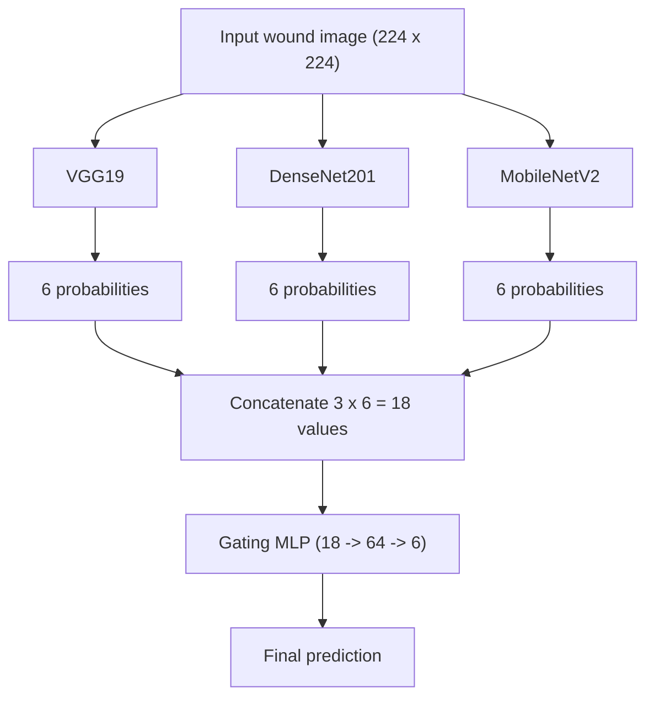
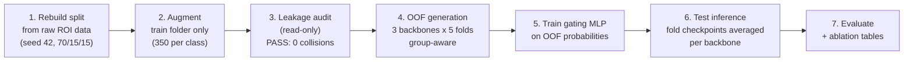

<div align="center">


# Chronic Wound Classification - Gated Multi-Model Fusion

**A leakage-free deep learning pipeline that classifies wound photographs into six categories, using three CNN backbones combined by a learned gating network.**

> **Research extension of** *"A Decision-Level Fusion Framework for Enhanced Multi-Class Chronic Wound Detection"* - Shamoon, Mustafa, Urooj & Mushtaq (FAST NUCES). This project replaces that study's decision-fusion stage with a learned gating network trained on out-of-fold predictions, and re-runs the entire evaluation under an audited, leakage-safe protocol.


*Two clean evaluation iterations, both reported honestly:*
**Baseline 73.87% accuracy** → **Improvement Round 79.28% accuracy** on the same untouched test set.

</div>

---

## Table of Contents

- [1. What this project does](#1-what-this-project-does)
- [2. How the system works](#2-how-the-system-works)
- [3. Processing pipeline](#3-processing-pipeline)
- [4. What went wrong and how it was fixed](#4-what-went-wrong-and-how-it-was-fixed)
- [5. Results](#5-results)
  - [5.1 Headline results - both iterations](#51-headline-results--both-iterations)
  - [5.2 Per-class results and confusion matrices](#52-per-class-results-and-confusion-matrices)
  - [5.3 Ablation - the gate wins every comparison](#53-ablation--the-gate-wins-every-comparison)
- [6. The Improvement Round](#6-the-improvement-round)
- [7. Getting started](#7-getting-started)
- [8. Repository structure](#8-repository-structure)
- [9. Reproducibility](#9-reproducibility)
- [10. Limitations and roadmap](#10-limitations-and-roadmap)
- [Acknowledgments](#acknowledgments)

---

## 1. What this project does

Given one photograph, the system selects one of six labels:

| Class | Meaning |
|---|---|
| `background` | No wound visible (surface, cloth, background skin) |
| `normal-skin` | Healthy intact skin |
| `diabetic` | Diabetic foot ulcer |
| `venous` | Venous leg ulcer |
| `pressure` | Pressure ulcer (bed sore) |
| `surgical` | Surgical wound |

**In plain language:** three experienced "specialist" models each look at the photo and give an opinion (six probabilities each). A small fourth network - the **gating network** - acts as a coordinator: it reads all three opinions and learns which specialist to trust more for *this particular image*. The coordinator's answer becomes the final classification.

Why an ensemble? Different architectures make different mistakes. A coordinator that weighs them per image can outperform any fixed combination - and this repository contains the experimental proof (Section 5.3).

## 2. How the system works



| Component | Where | What it does |
|---|---|---|
| Backbones | `scripts/gen_oof_preds.py` | Pretrained on ImageNet, six-class head added |
| Group-aware cross-validation | `scripts/gen_oof_preds.py` | `StratifiedGroupKFold` (5 folds) keeps an original image and all its augmented copies inside one fold |
| Gating network | `scripts/fusion/train_gating_mlp.py` | Small MLP trained on OOF probabilities only; validated on an OOF split, never on the test set |
| Evaluation | `scripts/evaluate_gated_fusion.py` | Computes metrics on the untouched test set |
| Ablation | `scripts/make_ablation_table.py` | Compares singles, averaging, majority vote and gating from saved artifacts (no retraining) |

**Training stages per backbone (per fold):** *Phase 1* trains only the classification head while the pretrained feature extractor is frozen. *Phase 2* unfreezes the last feature block and fine-tunes it at lr/10 - it was skipped in the baseline iteration (CPU budget) and executed in the Improvement Round (Section 6).

## 3. Processing pipeline



Each numbered stage is one script; the commands are in [Section 7](#7-getting-started). Stage 3 must pass before any training is allowed to produce reportable numbers.

## 4. What went wrong and how it was fixed

An earlier version of this pipeline contained **data leakage**: evaluation data influenced training in an invalid way, so the earlier accuracy was inflated and could not be reported. In plain terms, the model was being asked questions it had already seen the answers to. Two code bugs and one methodological flaw were identified:

| # | Problem | Plain description | Fix |
|---|---|---|---|
| 1 | Fallback copy | When an expected test file was missing, the script silently copied a training image into the test folder | Removed; a missing file now raises an error |
| 2 | Fabricated test paths | The gating stage *constructed* test paths by renaming train paths instead of reading the real test directory | Gating script now scans `data/processed/test/` directly; paths are never derived from train metadata |
| 3 | Non-group-aware split | Augmented copies of one source image could land on both sides of a fold boundary (near-duplicate leakage that filename checks cannot detect) | `StratifiedGroupKFold` with group = original source stem |

Remediation performed:

- Train/val/test partitions were rebuilt directly from the raw AZH ROI source (seed 42, 70/15/15); augmentation touches the training folder only.
- All artifacts from the leaked configuration were archived locally and excluded from reporting.
- Independent audits were run and captured; both passed:

```
Exact filename collisions (train vs val/test): 0
  of which BYTE-IDENTICAL (confirmed leak):     0
Group-id collisions (original/aug siblings):   0
>>> No leakage detected.
```

The captured audit outputs are committed at `outputs/leakage_audit_output.txt` and `outputs/check_clean_split_output.txt`.

> **Engineering principle adopted:** never fabricate data to satisfy a code path. A missing file is information that something upstream is broken - fail loudly instead of inventing the missing piece.

## 5. Results

All numbers come from evaluations on a clean, untouched test set of **111 images**. Two iterations are reported, both evaluated exactly once and never used for tuning.

### 5.1 Headline results - both iterations

| Metric | Baseline (first clean iteration) | **Final (Improvement Round)** |
|---|---|---|
| **Overall accuracy** | 73.87% (82 / 111) | **79.28% (88 / 111)** |
| **Macro F1** | 74.49% | **79.43%** |
| **Weighted F1** | 74.33% | **79.44%** |
| 95% Wilson CI (accuracy) | 65.0% – 81.1% | 70.8% – 85.8% |

With 111 test images, differences smaller than ~5 accuracy points are within statistical noise; both results are stated with this uncertainty attached. The baseline is retained as documentation of the pipeline's first honest iteration - **no result in this repository has ever been tuned against the test set** (recipe decisions were made on out-of-fold validation metrics only).

### 5.2 Per-class results and confusion matrices

**Final model (Improvement Round):**

| Class | Precision | Recall | F1 | Test images |
|---|---|---|---|---|
| background | 1.0000 | 1.0000 | 1.0000 | 15 |
| diabetic | 0.8261 | 0.8261 | 0.8261 | 23 |
| normal-skin | 1.0000 | 1.0000 | 1.0000 | 15 |
| pressure | 0.4118 | 0.4667 | 0.4375 | 15 |
| surgical | 0.7500 | 0.6316 | 0.6857 | 19 |
| venous | 0.8000 | 0.8333 | 0.8163 | 24 |

Rows = true class, columns = predicted class (order: background, diabetic, normal-skin, pressure, surgical, venous) - **baseline → final:**

```
Baseline:                          Final:
[[14  0  1  0  0  0]               [[15  0  0  0  0  0]
 [ 0 16  0  3  0  4]                [ 0 19  0  1  0  3]
 [ 0  1 14  0  0  0]                [ 0  0 15  0  0  0]
 [ 0  2  0  7  4  2]                [ 0  2  0  7  4  2]
 [ 0  2  0  5 11  1]                [ 0  2  0  5 12  0]
 [ 0  0  0  4  0 20]]               [ 0  0  0  4  0 20]]
```

**Honest reading:** after the Improvement Round, both non-wound classes are perfect, diabetic recall rose from 69.6% to 82.6%, and surgical-to-pressure errors fell from 5 to 0. **Pressure remains the weakest class and behaves as a confusion sink** - this is stated explicitly rather than hidden, and it drives the roadmap (Section 10). Pressure predictions from the current system should not be acted on clinically.

### 5.3 Ablation - the gate wins every comparison

All methods evaluated on the same clean test set from saved artifacts (no retraining). **Final configuration:**

| Method | Accuracy | Macro F1 | Weighted F1 |
|---|---|---|---|
| VGG19 (single) | 71.17% | 71.31 | 70.69 |
| DenseNet201 (single) | 76.58% | 76.45 | 76.45 |
| MobileNetV2 (single) | 73.87% | 72.71 | 73.01 |
| Simple average fusion | 78.38% | 77.70 | 78.04 |
| Majority vote | 78.38% | 77.66 | 77.77 |
| **Gated MLP fusion (final method)** | **79.28%** | **79.43** | **79.44** |

The learned gate beats the best single backbone (**+2.98 macro F1**), simple averaging (**+1.72**) and majority voting (**+1.76**). In the baseline round the gate was only tied with the strongest single model - meaning the value of learned per-image weighting *grows* as backbone quality improves. This is the central experimental finding of the project.

## 6. The Improvement Round

After the baseline was frozen, a single controlled improvement round was executed on a free cloud GPU (Colab T4, ~5 h total vs ~30 h CPU for the baseline). The data pipeline was untouched; only the training recipe changed:

| Element | Baseline | Improvement Round | Why |
|---|---|---|---|
| Phase 1 epochs | up to 8 | up to 20 (early stopping patience 5) | Baseline logs showed validation loss still falling at epoch 8 |
| Phase 2 fine-tuning | not executed | executed (last block, lr/10) | The lever CPU constraints had prevented |
| Label smoothing | 0.0 | 0.1 | Reduces overconfidence on visually overlapping classes |

**Evaluation discipline:** out-of-fold gains were confirmed first (VGG +0.01, DenseNet +2.81, MobileNet +5.03 macro F1) and only then was the final test evaluation run - once. An identical re-run after a session failure reproduced identical loss values, confirming deterministic seeding. Full details in `docs/REPORT.md` (Section 16).

## 7. Getting started

Prerequisites: Python 3.11+, Git. A CUDA GPU is *not* required for the baseline recipe (it was designed for, and completed on, CPU only).

```powershell
git clone https://github.com/AbdurRehmanKhan-ARK/chronic-wound-fusion.git
cd chronic-wound-fusion

python -m venv .venv
.\.venv\Scripts\activate
pip install -r requirements.txt
```

Core dependencies: `torch`, `torchvision`, `scikit-learn>=1.1` (for `StratifiedGroupKFold`), `numpy`, `pandas`, `Pillow`, `matplotlib`.

Full pipeline, in execution order (repo root, venv active):

```powershell
# 1. Rebuild clean train/val/test from the raw AZH ROI data (seed 42, 70/15/15)
python scripts\rebuild_clean_split.py

# 2. Augment the training folder ONLY (balanced 350 per class, seed 42)
python scripts\augment_train_only.py

# 3. Audit split integrity (read-only; must PASS before training)
python leakage_audit.py
python scripts\check_clean_split.py

# 4a. Baseline recipe - Phase 1 only, 8 epochs
python scripts\gen_oof_preds.py --model vgg19        --folds 5 --phase1-epochs 8 --batch-size 16 --lr 1e-4 --weight-decay 1e-4 --output outputs\01_oof\vgg19_clean
python scripts\gen_oof_preds.py --model densenet201  --folds 5 --phase1-epochs 8 --batch-size 16 --lr 1e-4 --weight-decay 1e-4 --output outputs\01_oof\densenet201_clean
python scripts\gen_oof_preds.py --model mobilenet_v2 --folds 5 --phase1-epochs 8 --batch-size 16 --lr 1e-4 --weight-decay 1e-4 --output outputs\01_oof\mobilenetv2_clean

# 4b. Final recipe (Improvement Round) - add Phase 2, longer training, label smoothing
python scripts\gen_oof_preds.py --model vgg19 --folds 5 --phase1-epochs 20 --phase2 --label-smoothing 0.1 --batch-size 16 --lr 1e-4 --weight-decay 1e-4 --output outputs\01_oof\vgg19_improved
python scripts\gen_oof_preds.py --model densenet201 --folds 5 --phase1-epochs 20 --phase2 --label-smoothing 0.1 --batch-size 16 --lr 1e-4 --weight-decay 1e-4 --output outputs\01_oof\densenet201_improved
python scripts\gen_oof_preds.py --model mobilenet_v2 --folds 5 --phase1-epochs 20 --phase2 --label-smoothing 0.1 --batch-size 16 --lr 1e-4 --weight-decay 1e-4 --output outputs\01_oof\mobilenet_v2_improved

# 5. Train the gating MLP on OOF probabilities + clean test evaluation
python scripts\fusion\train_gating_mlp.py --models vgg19,densenet201,mobilenet_v2 --oof-dir outputs\01_oof --output outputs\02_gating

# 6. Final metrics report and confusion matrix
python scripts\evaluate_gated_fusion.py --preds-csv outputs\02_gating\gating_test_preds_v1.csv --output outputs\03_figures

# 7. Ablation / fusion comparison table (no retraining, no GPU needed)
python scripts\make_ablation_table.py --probs outputs\02_gating\gating_test_probs_v1.npy --preds outputs\02_gating\gating_test_preds_v1.csv
```

Each OOF run saves `{model}_oof_probs.npy`, `{model}_oof_meta.csv`, and `checkpoints/{model}_fold{k}_best.pt`. The gating run saves `gating_mlp_model_v1.pt`, `gating_test_probs_v1.npy` (111 x 18) and `gating_test_preds_v1.csv`.

## 8. Repository structure

Scripts marked **[pipeline]** are the canonical pipeline used for the reported results. Scripts marked **[legacy]** are earlier prototypes kept for reference and are not part of the reported pipeline.

```
chronic-wound-fusion/
├── README.md
├── leakage_audit.py                   # [pipeline] standalone split-integrity audit (read-only)
├── requirements.txt
├── configs/
│   └── default.yaml                   # [legacy] prototype config; does NOT describe the reported runs
├── docs/
│   ├── REPORT.md                      # Full verified report: debugging + both iterations + evidence
│   ├── assets/banner.png              # Repository banner
│   ├── project-plan.docx              # Original project plan
│   └── chronic_fusion_extracted.txt   # Extracted text of the earlier written report
├── notebooks/
│   └── 01_setup_check.ipynb           # Environment sanity checks
├── outputs/                           # Committed verification evidence (small text files)
│   ├── leakage_audit_output.txt       # Audit result: 0 collisions, PASS
│   ├── check_clean_split_output.txt   # Split overlap check: 0 duplicates, PASS
│   ├── split_counts.txt               # Per-class train/val/test counts (2100 / 110 / 111)
│   ├── 03_figures/                    # Baseline iteration results
│   └── 03_figures_improved/           # Final iteration results (79.28%)
├── scripts/
│   ├── rebuild_clean_split.py         # [pipeline] raw ROI -> clean train/val/test (seed 42, 70/15/15)
│   ├── augment_train_only.py          # [pipeline] balanced offline augmentation, train folder only
│   ├── check_clean_split.py           # [pipeline] partition overlap check
│   ├── gen_oof_preds.py               # [pipeline] group-aware 5-fold OOF training per backbone
│   ├── fusion/train_gating_mlp.py     # [pipeline] canonical gating trainer + clean test evaluation
│   ├── evaluate_gated_fusion.py       # [pipeline] final metrics from gate predictions
│   ├── make_ablation_table.py         # [pipeline] fusion comparison from saved artifacts (no retraining)
│   ├── dataset_stats.py               # [utility] per-split, per-class image counts
│   ├── verify_data.py                 # [utility] raw ROI image counts
│   ├── augment_and_save.py            # [legacy] older augmentation variant
│   ├── train_base.py                  # [legacy] simple single-model trainer
│   ├── train_backbone_small.py        # [legacy] small-subset experiments
│   ├── train_vgg_small.py             # [legacy] small-subset VGG experiments
│   ├── evaluate_vgg.py                # [legacy] single-model evaluation
│   ├── evaluate_checkpoint.py         # [legacy] single-checkpoint evaluation (imports train_backbone_small)
│   ├── train_gating.py                # [legacy] lighter OOF-only gate trainer (no test evaluation)
│   └── parse_docx.py                  # [utility] docx text extraction used for report drafting
└── src/
    ├── data/
    │   ├── dataset.py
    │   └── preprocess.py
    └── models/
        ├── backbones.py               # VGG19 / DenseNet201 / MobileNetV2 loaders
        └── gating.py                  # older feature-based gate variant (canonical gate: GatingMLP in fusion/)
```

`data/` (raw and processed) and the large intermediate outputs (`outputs/01_oof/`, `outputs/02_gating*/`, checkpoints, `.npy` arrays) are generated locally and excluded from version control via `.gitignore` - they are reproducible with the Section 7 commands. The committed text files under `outputs/` are the captured verification evidence.

## 9. Reproducibility

| Item | Value |
|---|---|
| Random seed | 42 (fixed across Python, NumPy, PyTorch; folds and the gate's validation split included) |
| Split | 70/15/15 per class from raw ROI data; test = 111 images (15/23/15/15/19/24) |
| Training data | 2,100 images (balanced 350 per class after augmentation); val = 110 originals; no augmented file in val or test (audited) |
| Input | 224 x 224, ImageNet normalization (mean 0.485/0.456/0.406, std 0.229/0.224/0.225) |
| Baseline training | Phase 1 only: up to 8 epochs/fold, patience 5, Adam lr 1e-4, wd 1e-4, batch 16; CPU only (~30 h total) |
| Final training | Phase 1 (up to 20 epochs) + Phase 2 (last block, lr/10), label smoothing 0.1; Colab T4 GPU (~5 h) |
| Gating | MLP 18-64-6, Dropout 0.2, up to 50 epochs, patience 5, batch 64, lr 1e-3, wd 1e-4; validated on a 20% stratified OOF split |
| Pretrained weights | torchvision `IMAGENET1K_V1` for all three backbones |
| Test inference | Per backbone: softmax averaged over the 5 fold checkpoints; concatenated 18-value vector fed to the gate |
| Determinism | An identical re-run of the final recipe reproduced identical loss values (seed verification) |

Notes: per-fold epoch counts and the gate's exact stopping epoch were printed to console only and are documented as "up to N with early stopping". The class in `src/models/gating.py` is an older feature-based variant; the canonical gate used by the pipeline is `GatingMLP` in `scripts/fusion/train_gating_mlp.py`.

## 10. Limitations and roadmap

**Known limitations, stated openly:**

1. Small test set (111 images, 15–24 per class) gives wide confidence intervals (Section 5.1).
2. Single dataset (AZH); other cameras, centres and populations are untested.
3. Grouping is by source image stem; the AZH ROI release has no patient IDs, so patient-level independence is not guaranteed.
4. **Pressure remains unreliable** (recall 46.7%, F1 0.44 even in the final model); surgical is marginal. This system is a research prototype, not a clinical tool.

**Roadmap:**

1. More pressure-class data - the most direct remedy for the weakest class.
2. Class-weighted or focal loss experiments for the pressure–surgical boundary (selected on OOF/validation only).
3. Gate calibration (temperature scaling, selected on validation only).
4. External-dataset validation before any clinical claim.
5. Patient-level grouping if identifiers ever become available.

---

<div align="center">

### 💡 The story in one line

> **We audited our own pipeline, caught the leakage that made our first numbers lie,
> rebuilt everything honestly - and then improved the honest number.**

**73.87%** *was not a failure. It was the first number we could trust.*
**79.28%** *is what disciplined, leakage-free iteration looks like.* 🎯

Built with ☕, 🧠 and a lot of 🔍 by **Abdur Rehman Khan (24K-0767, BCS-G)**
Research Extension · FAST NUCES · Supervised by **Ms. Sania Urooj**

⭐ *If this repository helped you understand leakage-free ML evaluation, consider starring it.*

</div>

## Acknowledgments

- 📄 **Prior work** - *A Decision-Level Fusion Framework for Enhanced Multi-Class Chronic Wound Detection*, S. Shamoon, A. Mustafa, S. Urooj, M. Mushtaq (FAST NUCES). This repository is a leakage-safe extension of that study.
- 👩‍🏫 **Ms. Sania Urooj** - supervisor of this extension and co-author of the original study.
- 🩹 **AZH wound dataset** - Advancing the Zenith in Healthcare chronic wound dataset.
- 🤖 Pretrained architectures via **torchvision** (VGG19, DenseNet201, MobileNetV2, ImageNet weights).
- ☁️ Improvement-round compute via **Google Colab** (free T4 GPU).
